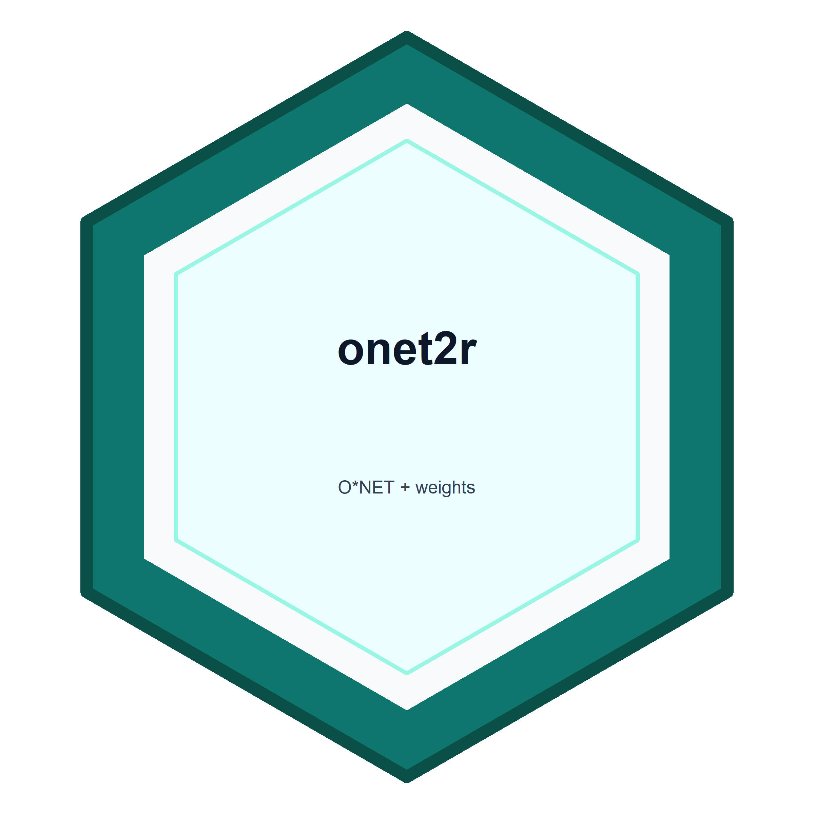

```{r, include = FALSE}
knitr::opts_chunk$set(
  collapse = TRUE,
  comment = "#>",
  fig.path = "man/figures/README-",
  fig.width = 7,
  fig.height = 4
)
options(tibble.print_min = 4, tibble.print_max = 8)
options(
  cli.num_colors = 1,
  crayon.enabled = FALSE,
  pillar.bold = FALSE,
  pillar.subtle = FALSE
)
local({
  output_hook <- knitr::knit_hooks$get("output")
  knitr::knit_hooks$set(output = function(x, options) {
    x <- gsub("[ \t]+(\r?\n)", "\\1", x)
    output_hook(x, options)
  })
})
```

# onet2r 

`onet2r` is an R package for working with O&#42;NET Web Services, archived
O&#42;NET database releases, O&#42;NET-SOC taxonomy bridges, BLS OEWS wage and
employment context, and reproducible user-supplied occupation measures.

The package is built for analysts who need tidy current-release O&#42;NET data and
for researchers who need to ask careful historical questions. O&#42;NET was not
designed as a longitudinal panel, so `onet2r` makes the plumbing visible:
archive versions, taxonomy seams, source dates, employment weights, coverage,
and provenance.

## Installation

You can install the development version from GitHub:

```r
# install.packages("pak")
pak::pak("farach/onet2r")
```

## Authentication

Live O&#42;NET API calls require a free API key from
<https://services.onetcenter.org/developer/>. Store it in `.Renviron`:

```r
ONET_API_KEY=your-api-key-here
```

The archive, OEWS, and measure examples below run without a key.

```{r setup, include = FALSE}
suppressPackageStartupMessages({
  library(onet2r)
  library(dplyr)
  helper_paths <- c(
    "inst/vignette-helpers.R",
    "vignette-helpers.R",
    system.file("vignette-helpers.R", package = "onet2r")
  )
  helper_path <- helper_paths[
    nzchar(helper_paths) & file.exists(helper_paths)
  ][[1]]
  source(helper_path)
})
```

## Read Archived Releases

```{r archive-panel}
archive_base <- system.file("extdata", "onet-mini", package = "onet2r")
archives <- c(
  `24.3` = file.path(archive_base, "db_24_3_text"),
  `25.1` = file.path(archive_base, "db_25_1_text")
)
release_dates <- c(`24.3` = "2020-08-01", `25.1` = "2020-11-01")

abilities <- onet_panel(
  "Abilities",
  versions = c("24.3", "25.1"),
  scale = "IM",
  archives = archives,
  release_dates = release_dates
)

abilities |>
  select(release_version, onet_soc_code, soc_code, element_name, data_value) |>
  head(6) |>
  onet_kable()
```

O&#42;NET-SOC remains at the native 8-digit detail level in `onet_soc_code`.
The 6-digit `soc_code` exists for labor-market joins.

## Reconcile Historical Change

```{r reconcile}
bridge_2010_2019 <- tibble::tibble(
  from_vintage = "2010",
  to_vintage = "2019",
  from_onet_soc_code = c("15-1132.00", "15-1132.00", "29-1141.00"),
  to_onet_soc_code = c("15-1252.00", "15-1253.00", "29-1141.00"),
  map_type = c("split", "split", "one_to_one"),
  crosswalk_weight = c(0.5, 0.5, 1)
)

changes <- onet_panel_reconcile(
  abilities,
  bridge = bridge_2010_2019
)

changes |>
  select(
    from_onet_soc_code,
    to_onet_soc_code,
    element_name,
    from_value,
    to_value,
    value_change,
    change_type,
    safely_comparable
  ) |>
  arrange(desc(abs(value_change))) |>
  head(8) |>
  onet_kable()
```

```{r change-chart, fig.alt = "Horizontal bar chart of cross-vintage archive change classifications in the bundled example panel."}
change_counts <- changes |>
  count(change_type, name = "rows") |>
  arrange(desc(rows))

ggplot2::ggplot(change_counts, ggplot2::aes(
  x = stats::reorder(change_type, rows),
  y = rows,
  fill = change_type
)) +
  ggplot2::geom_col(width = 0.65, show.legend = FALSE) +
  ggplot2::coord_flip() +
  onet2r_discrete_fill() +
  ggplot2::labs(
    title = "Cross-Vintage Rows Need Reconciliation",
    subtitle = "The bundled fixture crosses a 2010-to-2019 O*NET-SOC seam.",
    x = NULL,
    y = "Rows"
  ) +
  onet2r_theme()
```

Rows marked as transition data, suppressed estimates, new content, or dropped
content are visible in `change_type`. They are not counted as safely comparable
updates.

## Bring Your Own Measure

The package does not ship an AI exposure score or any other substantive measure.
You supply a score, and `onet2r` validates keys, performs mechanical rollups,
adds weights, and records provenance.

```{r task-measure}
tasks <- onet_archive_read(
  "30.3",
  "Task Statements",
  path = file.path(archive_base, "db_30_3_text"),
  release_date = "2026-05-01"
)
task_ratings <- onet_archive_read(
  "30.3",
  "Task Ratings",
  path = file.path(archive_base, "db_30_3_text"),
  release_date = "2026-05-01"
)

task_scores <- tibble::tibble(
  task_id = c("1001", "1002", "2001"),
  score = c(0.80, 0.40, 0.20)
)

measure <- onet_measure(
  task_scores,
  key = "task_id",
  score = "score",
  key_type = "task",
  universe = tasks$task_id,
  measure_id = "stylized_task_score"
)

onet_coverage(measure) |>
  onet_kable()
```

```{r task-rollup}
occupation_scores <- onet_task_to_occupation(
  measure,
  task_ratings = task_ratings,
  task_metadata = tasks,
  include_supplemental = FALSE
)

occupation_scores |>
  onet_kable()
```

## Add Employment Weights

```{r weights}
oews_sample <- onet_oews_national(
  path = system.file("extdata", "oews-national-sample.csv", package = "onet2r")
)

weights <- onet_weight_panel_oews(oews_sample, year = 2024)

weights |>
  onet_kable()
```

```{r aggregate}
aggregate <- onet_measure_aggregate(
  occupation_scores,
  weights,
  measure_id = "stylized_task_score"
)

aggregate |>
  select(-coverage, -provenance) |>
  onet_kable()

onet_provenance(aggregate) |>
  onet_kable()
```

## Stress Test the Plumbing

```{r sensitivity}
pums_weights <- onet_weight_panel_pums(
  tibble::tibble(
    SOCP = c("151252", "151252", "291141", "291141"),
    PWGTP = c(80, 120, 200, 80)
  ),
  year = 2022
)

sensitivity <- onet_measure_sensitivity(
  measure,
  weight_panels = list(oews = weights, pums = pums_weights),
  task_ratings = task_ratings,
  task_metadata = tasks,
  include_supplemental = c(FALSE, TRUE)
)

sensitivity |>
  select(
    scenario,
    aggregate,
    employment_coverage_share,
    movement,
    movement_percent
  ) |>
  onet_kable()
```

## Decompose Aggregate Change

```{r decomposition}
from_scores <- tibble::tibble(
  reference_soc_code = c("15-1252", "29-1141"),
  measure_score = c(1.0, 2.0),
  safely_comparable = c(TRUE, FALSE)
)
to_scores <- tibble::tibble(
  reference_soc_code = c("15-1252", "29-1141"),
  measure_score = c(2.0, 2.5),
  safely_comparable = c(TRUE, FALSE)
)
from_weights <- tibble::tibble(
  reference_soc_code = c("15-1252", "29-1141"),
  employment = c(100, 100)
)
to_weights <- tibble::tibble(
  reference_soc_code = c("15-1252", "29-1141"),
  employment = c(150, 50)
)

decomp <- onet_decompose_change(from_scores, to_scores, from_weights, to_weights)

decomp |>
  select(component, value) |>
  onet_kable()

onet_coverage(decomp) |>
  onet_kable()
```

## Main Function Groups

- Current O&#42;NET API data: `onet_search()`, `onet_occupation()`,
  `onet_skills()`, `onet_tasks()`, `onet_table()`.
- Archived O&#42;NET data: `onet_releases()`, `onet_archive_download()`,
  `onet_archive_read()`, `onet_panel()`, `onet_panel_reconcile()`.
- Wage and employment context: `onet_oews_national()`,
  `onet_weight_panel_oews()`, `onet_weight_panel_pums()`.
- User-measure plumbing: `onet_measure()`, `onet_task_to_occupation()`,
  `onet_measure_aggregate()`, `onet_measure_sensitivity()`,
  `onet_provenance()`, `onet_coverage()`, `onet_decompose_change()`.
