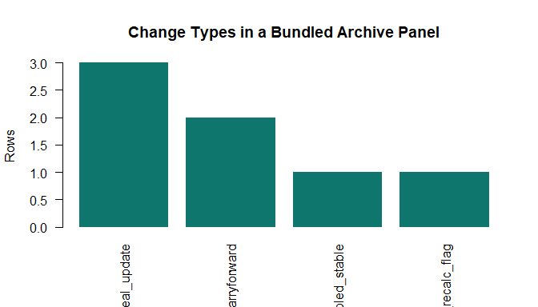

# onet2r 

`onet2r` is an R package for working with O\*NET Web Services, archived
O\*NET database releases, O\*NET-SOC taxonomy bridges, BLS OEWS wage and
employment context, and reproducible user-supplied occupation measures.

The package is built for analysts who need tidy current-release O\*NET
data and for researchers who need to ask careful historical questions.
O\*NET was not designed as a longitudinal panel, so `onet2r` makes the
plumbing visible: archive versions, taxonomy seams, source dates,
employment weights, coverage, and provenance.

## Installation

``` r
install.packages("onet2r")
```

You can install the development version from GitHub:

``` r
# install.packages("pak")
pak::pak("farach/onet2r")
```

## Authentication

Live O\*NET API calls require a free API key from
<https://services.onetcenter.org/developer/>. Store it in `.Renviron`:

``` r
ONET_API_KEY=your-api-key-here
```

The archive, OEWS, and measure examples below run without a key.

## Read Archived Releases

``` r
archive_base <- system.file("extdata", "onet-mini", package = "onet2r")
archives <- c(
  `30.2` = file.path(archive_base, "db_30_2_text"),
  `30.3` = file.path(archive_base, "db_30_3_text")
)
release_dates <- c(`30.2` = "2026-02-01", `30.3` = "2026-05-01")

abilities <- onet_panel(
  "Abilities",
  versions = c("30.2", "30.3"),
  scale = "IM",
  archives = archives,
  release_dates = release_dates
)

abilities |>
  select(release_version, onet_soc_code, soc_code, element_name, data_value) |>
  head(6)
#> # A tibble: 6 × 5
#>   release_version onet_soc_code soc_code element_name        data_value
#>   <chr>           <chr>         <chr>    <chr>                    <dbl>
#> 1 30.2            15-1252.00    15-1252  Oral Comprehension        4.12
#> 2 30.2            15-1252.00    15-1252  Problem Sensitivity       4.5
#> 3 30.2            29-1141.00    29-1141  Oral Comprehension        4.71
#> 4 30.2            29-1141.00    29-1141  Problem Sensitivity       4.6
#> 5 30.2            11-1011.00    11-1011  Oral Comprehension        4.38
#> 6 30.2            11-1011.00    11-1011  Problem Sensitivity       4.22
```

O\*NET-SOC remains at the native 8-digit detail level in
`onet_soc_code`. The 6-digit `soc_code` exists for labor-market joins.

## Reconcile Historical Change

``` r
changes <- onet_panel_reconcile(
  abilities,
  bridge = onet_crosswalk_bridge("2019", "2019")
)

changes |>
  select(
    from_onet_soc_code,
    to_onet_soc_code,
    element_name,
    from_value,
    to_value,
    value_change,
    change_type,
    safely_comparable
  ) |>
  arrange(desc(abs(value_change))) |>
  head(8) |>
  print(width = Inf)
#> # A tibble: 7 × 8
#>   from_onet_soc_code to_onet_soc_code element_name        from_value to_value
#>   <chr>              <chr>            <chr>                    <dbl>    <dbl>
#> 1 29-1141.00         29-1141.00       Problem Sensitivity       4.6      4.9
#> 2 15-1252.00         15-1252.00       Oral Comprehension        4.12     4.35
#> 3 41-1011.00         41-1011.00       Oral Comprehension        4        4.15
#> 4 11-1011.00         11-1011.00       Oral Comprehension        4.38     4.5
#> 5 15-1252.00         15-1252.00       Problem Sensitivity       4.5      4.5
#> 6 29-1141.00         29-1141.00       Oral Comprehension        4.71     4.71
#> 7 11-1011.00         11-1011.00       Problem Sensitivity       4.22     4.22
#>   value_change change_type           safely_comparable
#>          <dbl> <fct>                 <lgl>
#> 1        0.300 recode_or_recalc_flag FALSE
#> 2        0.230 real_update           TRUE
#> 3        0.150 real_update           TRUE
#> 4        0.120 real_update           FALSE
#> 5        0     stale_carryforward    TRUE
#> 6        0     resampled_stable      TRUE
#> 7        0     stale_carryforward    TRUE
```

``` r
change_counts <- changes |>
  count(change_type, name = "rows") |>
  arrange(desc(rows))

barplot(
  height = setNames(change_counts$rows, change_counts$change_type),
  col = "#0f766e",
  border = NA,
  las = 2,
  ylab = "Rows",
  main = "Change Types in a Bundled Archive Panel"
)
```



Rows marked as transition data, suppressed estimates, new content, or
dropped content are visible in `change_type`. They are not counted as
safely comparable updates.

## Bring Your Own Measure

The package does not ship an AI exposure score or any other substantive
measure. You supply a score, and `onet2r` validates keys, performs
mechanical rollups, adds weights, and records provenance.

``` r
tasks <- onet_archive_read(
  "30.3",
  "Task Statements",
  path = archives[["30.3"]],
  release_date = "2026-05-01"
)
task_ratings <- onet_archive_read(
  "30.3",
  "Task Ratings",
  path = archives[["30.3"]],
  release_date = "2026-05-01"
)

task_scores <- tibble::tibble(
  task_id = c("1001", "1002", "2001"),
  score = c(0.80, 0.40, 0.20)
)

measure <- onet_measure(
  task_scores,
  key = "task_id",
  score = "score",
  key_type = "task",
  universe = tasks$task_id,
  measure_id = "stylized_task_score"
)

onet_coverage(measure)
#> # A tibble: 1 × 6
#>   key_type n_input n_universe n_matched coverage_share employment_coverage_share
#>   <chr>      <int>      <int>     <int>          <dbl>                     <dbl>
#> 1 task           3          3         3              1                        NA
```

``` r
occupation_scores <- onet_task_to_occupation(
  measure,
  task_ratings = task_ratings,
  task_metadata = tasks,
  include_supplemental = FALSE
)

occupation_scores
#> # A tibble: 2 × 5
#>   onet_soc_code n_tasks total_task_weight measure_score soc_code
#>   <chr>           <int>             <dbl>         <dbl> <chr>
#> 1 15-1252.00          1                95           0.8 15-1252
#> 2 29-1141.00          1                98           0.2 29-1141
```

## Add Employment Weights

``` r
oews_sample <- onet_oews_national(
  path = system.file("extdata", "oews-national-sample.csv", package = "onet2r")
)

weights <- onet_weight_panel_oews(oews_sample, year = 2024)

weights |>
  print(width = Inf)
#> # A tibble: 3 × 7
#>   reference_soc_code  year employment weight_share source source_taxonomy
#>   <chr>              <int>      <dbl>        <dbl> <chr>  <chr>
#> 1 11-1011             2024     211230       0.0404 OEWS   2018 SOC
#> 2 15-1252             2024    1847900       0.353  OEWS   2018 SOC
#> 3 29-1141             2024    3175400       0.607  OEWS   2018 SOC
#>   reference_taxonomy
#>   <chr>
#> 1 2018 SOC
#> 2 2018 SOC
#> 3 2018 SOC
```

``` r
aggregate <- onet_measure_aggregate(
  occupation_scores,
  weights,
  measure_id = "stylized_task_score"
)

aggregate |>
  select(-coverage, -provenance) |>
  print(width = Inf)
#> # A tibble: 1 × 7
#>   measure_id          aggregate total_employment covered_employment
#>   <chr>                   <dbl>            <dbl>              <dbl>
#> 1 stylized_task_score     0.421          5234530            5023300
#>   employment_coverage_share n_occupations n_reference_soc
#>                       <dbl>         <int>           <int>
#> 1                     0.960             2               2

onet_provenance(aggregate)
#> # A tibble: 1 × 7
#>   measure_id        weight_source weight_year source_taxonomy reference_taxonomy
#>   <chr>             <chr>               <int> <chr>           <chr>
#> 1 stylized_task_sc… OEWS                 2024 2018 SOC        2018 SOC
#> # ℹ 2 more variables: bridge_used <lgl>, crosswalk_path <chr>
```

## Stress Test the Plumbing

``` r
sensitivity <- onet_measure_sensitivity(
  measure,
  weight_panels = weights,
  task_ratings = task_ratings,
  task_metadata = tasks,
  include_supplemental = c(FALSE, TRUE)
)

sensitivity |>
  select(scenario, aggregate, employment_coverage_share, movement) |>
  print(width = Inf)
#> # A tibble: 2 × 4
#>   scenario                                                       aggregate
#>   <chr>                                                              <dbl>
#> 1 RT_core / task_release / weights / no_bridge                       0.421
#> 2 RT_core_plus_supplemental / task_release / weights / no_bridge     0.373
#>   employment_coverage_share movement
#>                       <dbl>    <dbl>
#> 1                     0.960   0
#> 2                     0.960  -0.0473
```

## Decompose Aggregate Change

``` r
from_scores <- tibble::tibble(
  reference_soc_code = c("15-1252", "29-1141"),
  measure_score = c(1.0, 2.0),
  safely_comparable = c(TRUE, FALSE)
)
to_scores <- tibble::tibble(
  reference_soc_code = c("15-1252", "29-1141"),
  measure_score = c(2.0, 2.5),
  safely_comparable = c(TRUE, FALSE)
)
from_weights <- tibble::tibble(
  reference_soc_code = c("15-1252", "29-1141"),
  employment = c(100, 100)
)
to_weights <- tibble::tibble(
  reference_soc_code = c("15-1252", "29-1141"),
  employment = c(150, 50)
)

decomp <- onet_decompose_change(from_scores, to_scores, from_weights, to_weights)

decomp |>
  select(component, value) |>
  print(width = Inf)
#> # A tibble: 5 × 2
#>   component       value
#>   <chr>           <dbl>
#> 1 within          0.5
#> 2 between        -0.25
#> 3 interaction     0.125
#> 4 unclassifiable  0.25
#> 5 total_change    0.625

onet_coverage(decomp)
#> # A tibble: 1 × 3
#>   n_common n_safely_comparable leakage
#>      <int>               <int>   <dbl>
#> 1        2                   1       0
```

## Main Function Groups

- Current O\*NET API data: `onet_search()`, `onet_occupation()`,
  `onet_skills()`, `onet_tasks()`, `onet_table()`.
- Archived O\*NET data: `onet_releases()`, `onet_archive_download()`,
  `onet_archive_read()`, `onet_panel()`, `onet_panel_reconcile()`.
- Wage and employment context: `onet_oews_national()`,
  `onet_weight_panel_oews()`, `onet_weight_panel_pums()`.
- User-measure plumbing: `onet_measure()`, `onet_task_to_occupation()`,
  `onet_measure_aggregate()`, `onet_measure_sensitivity()`,
  `onet_provenance()`, `onet_coverage()`, `onet_decompose_change()`.
